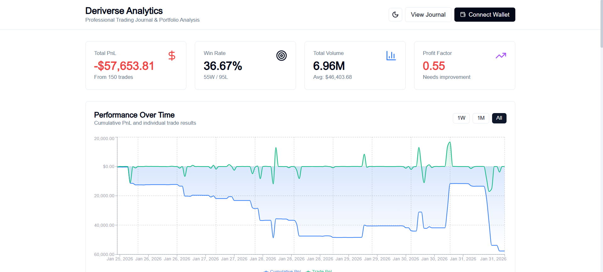
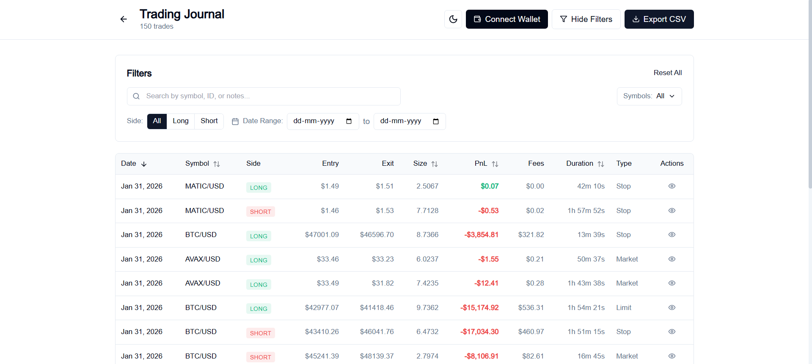
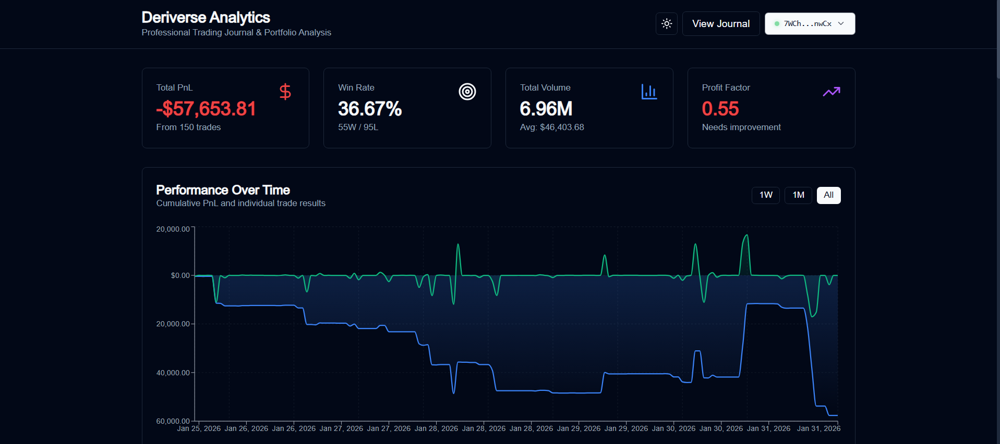

# 🚀 Deriverse Trading Analytics Dashboard

<div align="center">


**A comprehensive trading analytics solution for Deriverse with professional journal and portfolio analysis**

[Live Demo](#) | [Report Bug](https://github.com/Armaansaxena/Trading-Dashboard/issues) | [Request Feature](https://github.com/Armaansaxena/Trading-Dashboard/issues)

</div>

---

## 📋 Table of Contents

- [Overview](#overview)
- [Features](#features)
- [Tech Stack](#tech-stack)
- [Getting Started](#getting-started)
- [Project Structure](#project-structure)
- [Key Features Breakdown](#key-features-breakdown)
- [Architecture](#architecture)
- [Contributing](#contributing)
- [License](#license)
- [Contact](#contact)

---

## 🎯 Overview

Deriverse Trading Analytics Dashboard is a **production-ready** analytics platform designed for active traders on Deriverse. It provides comprehensive portfolio analysis, detailed trade journaling, and advanced performance metrics to help traders make data-driven decisions.

### Why This Dashboard?

- ✅ **Complete Analytics Suite** - All metrics from PnL to Sharpe ratio
- ✅ **Professional Trading Journal** - Sortable, searchable, with notes & tags
- ✅ **Advanced Visualizations** - Interactive charts for every metric
- ✅ **Time-Based Analysis** - Hourly, daily, and weekly performance tracking
- ✅ **Solana Wallet Integration** - Connect with Phantom, Solflare, and more
- ✅ **Dark/Light Mode** - Fully themed for user preference
- ✅ **Export Capabilities** - CSV export for external analysis
- ✅ **Mobile Responsive** - Works seamlessly on all devices

---

## ✨ Features

### Core Analytics
- 📊 **Total PnL Tracking** with visual performance indicators
- 📈 **Win Rate Statistics** with win/loss breakdown
- 💰 **Trading Volume Analysis** with average calculations
- 💵 **Fee Analysis** - Breakdown of trading and network fees
- ⏱️ **Trade Duration Metrics** - Average holding time
- 📉 **Long/Short Ratio** - Directional bias tracking
- 🎯 **Risk Metrics** - Max drawdown, Sharpe ratio, Risk/Reward

### Advanced Features
- 📅 **Time-Based Performance**
  - Hourly performance heatmap
  - Day of week analysis
  - Session-based tracking
  
- 📊 **Interactive Charts**
  - Cumulative PnL over time
  - Drawdown visualization
  - Volume bar chart
  - Symbol performance comparison
  
- 📝 **Professional Trading Journal**
  - Sortable columns (Date, Symbol, PnL, Size, Duration)
  - Advanced filtering (Symbol, Side, Date Range, Search)
  - Pagination (20 trades per page)
  - Trade details modal with full breakdown
  - Editable notes and tags
  
- 💼 **Portfolio Management**
  - Symbol-specific filtering
  - Order type performance analysis
  - Fee composition breakdown
  - Cumulative fee tracking

### Innovation Features
- 🔐 **Solana Wallet Integration** - Connect with major wallets
- 🌓 **Dark/Light Theme** - User preference with persistence
- 📤 **CSV Export** - Export trades for external analysis
- 🎨 **Professional UI/UX** - Clean, intuitive design
- ⚡ **Performance Optimized** - Fast rendering with virtual scrolling
- 📱 **Fully Responsive** - Mobile, tablet, and desktop support

---

## 🛠️ Tech Stack

### Frontend
- **Framework**: [Next.js 14](https://nextjs.org/) - React framework with App Router
- **Language**: [TypeScript](https://www.typescriptlang.org/) - Type-safe development
- **Styling**: [Tailwind CSS](https://tailwindcss.com/) - Utility-first CSS
- **Charts**: [Recharts](https://recharts.org/) - Composable charting library
- **Icons**: [Lucide React](https://lucide.dev/) - Beautiful icon set

### State Management
- **Global State**: [Zustand](https://zustand-demo.pmnd.rs/) - Lightweight state management
- **Theme**: [next-themes](https://github.com/pacocoursey/next-themes) - Theme switching

### Blockchain
- **Wallet Adapter**: [@solana/wallet-adapter-react](https://github.com/solana-labs/wallet-adapter) - Solana wallet integration
- **Web3**: [@solana/web3.js](https://solana-labs.github.io/solana-web3.js/) - Solana JavaScript API

### Utilities
- **Date Handling**: [date-fns](https://date-fns.org/) - Modern date utility
- **Class Merging**: [clsx](https://github.com/lukeed/clsx) + [tailwind-merge](https://github.com/dcastil/tailwind-merge)

---

## 🚀 Getting Started

### Prerequisites

- **Node.js** 18.x or higher
- **npm** or **yarn** or **pnpm**
- **Git**

### Installation

1. **Clone the repository**
```bash
   git clone https://github.com/Armaansaxena/Trading-Dashboard.git
   cd Trading-Dashboard
```

2. **Install dependencies**
```bash
   npm install
   # or
   yarn install
   # or
   pnpm install
```

3. **Set up environment variables**
   
   Create a `.env.local` file in the root directory:
```env
   NEXT_PUBLIC_SOLANA_RPC_URL=https://api.mainnet-beta.solana.com
   NEXT_PUBLIC_DERIVERSE_API=https://api.deriverse.io
```

4. **Run the development server**
```bash
   npm run dev
   # or
   yarn dev
   # or
   pnpm dev
```

5. **Open your browser**
   
   Navigate to [http://localhost:3000](http://localhost:3000)

### Build for Production
```bash
npm run build
npm start
```

---

## 📁 Project Structure
```
trading-analytics-dashboard/
├── src/
│   ├── app/                          # Next.js App Router
│   │   ├── journal/
│   │   │   └── page.tsx             # Trading journal page
│   │   ├── layout.tsx               # Root layout with providers
│   │   ├── page.tsx                 # Main dashboard page
│   │   └── globals.css              # Global styles & themes
│   │
│   ├── components/                   # React components
│   │   ├── charts/                  # Chart components
│   │   │   ├── PnLChart.tsx         # PnL area/line chart
│   │   │   ├── DrawdownChart.tsx    # Drawdown visualization
│   │   │   ├── VolumeChart.tsx      # Volume bar chart
│   │   │   ├── HourlyHeatmap.tsx    # Hourly performance heatmap
│   │   │   ├── DayOfWeekChart.tsx   # Day of week bar chart
│   │   │   └── CumulativeFeesChart.tsx # Cumulative fees chart
│   │   │
│   │   ├── dashboard/               # Dashboard components
│   │   │   ├── MetricCard.tsx       # Reusable metric card
│   │   │   └── FeeBreakdown.tsx     # Fee analysis component
│   │   │
│   │   ├── journal/                 # Journal components
│   │   │   ├── TradeTable.tsx       # Sortable trade table
│   │   │   └── TradeDetailsModal.tsx # Trade details popup
│   │   │
│   │   ├── filters/                 # Filter components
│   │   │   ├── SearchBar.tsx        # Search input
│   │   │   ├── SideFilter.tsx       # Long/Short filter
│   │   │   ├── SymbolFilter.tsx     # Symbol multi-select
│   │   │   └── DateRangeFilter.tsx  # Date range picker
│   │   │
│   │   ├── wallet/                  # Wallet components
│   │   │   ├── WalletButton.tsx     # Custom wallet button
│   │   │   └── WalletInfo.tsx       # Wallet info display
│   │   │
│   │   ├── theme/                   # Theme components
│   │   │   └── ThemeToggle.tsx      # Dark/light mode toggle
│   │   │
│   │   └── providers/               # Context providers
│   │       ├── WalletProvider.tsx   # Solana wallet provider
│   │       └── ThemeProvider.tsx    # Theme provider
│   │
│   ├── store/                        # State management
│   │   └── tradingStore.ts          # Zustand trading store
│   │
│   ├── utils/                        # Utilities
│   │   ├── analytics.ts             # Analytics calculation engine
│   │   └── mockData.ts              # Mock data generator
│   │
│   ├── lib/                          # Helper libraries
│   │   └── utils.ts                 # Utility functions
│   │
│   └── types/                        # TypeScript types
│       └── trading.ts               # Trading interfaces
│
├── public/                           # Static assets
├── .env.local                        # Environment variables (create this)
├── .gitignore                        # Git ignore rules
├── next.config.js                    # Next.js configuration
├── tailwind.config.js                # Tailwind CSS configuration
├── tsconfig.json                     # TypeScript configuration
├── package.json                      # Dependencies
└── README.md                         # This file
```

---

## 🎨 Key Features Breakdown

### 1. Dashboard Analytics

**Main Dashboard** (`/`)
- **4 Key Metric Cards**: PnL, Win Rate, Volume, Profit Factor
- **Performance Chart**: Cumulative PnL with individual trades
- **Advanced Metrics Grid**: Risk metrics, Trade analysis, Extremes
- **Symbol Performance Table**: Top 8 symbols by profitability
- **Order Type Cards**: Market, Limit, Stop order performance
- **Drawdown Chart**: Equity decline visualization
- **Volume Chart**: Trading volume with profit/loss colors
- **Hourly Heatmap**: 24-hour performance grid
- **Day of Week Chart**: Best trading days
- **Fee Analysis**: Breakdown of trading vs network fees
- **Cumulative Fees**: Total fees paid over time

### 2. Trading Journal

**Journal Page** (`/journal`)
- **Sortable Table**: Click columns to sort
- **Advanced Filters**:
  - Search by symbol, ID, or notes
  - Symbol multi-select dropdown
  - Long/Short/All side filter
  - Date range picker
- **Pagination**: 20 trades per page with navigation
- **Trade Details Modal**:
  - Full PnL breakdown
  - Return percentage
  - Entry/Exit prices
  - Position size and duration
  - Order information
  - Editable notes
  - Editable tags
  - Transaction ID
- **Export**: CSV export for external analysis

### 3. Wallet Integration

- **Multi-Wallet Support**: Phantom, Solflare, and more
- **Auto-Connect**: Reconnects on return visits
- **Address Display**: Truncated with copy functionality
- **Connection Indicator**: Green pulse when connected
- **Disconnect**: Clean disconnection with menu

### 4. Theme System

- **Dark Mode**: Professional dark theme (default)
- **Light Mode**: Clean light theme
- **System Sync**: Follows OS preference
- **Persistent**: Saves preference in localStorage
- **Smooth Transitions**: No flash on page load

---

## 🏗️ Architecture

### Data Flow
```
User Action
    ↓
Component Event
    ↓
Zustand Store (tradingStore.ts)
    ↓
Analytics Engine (analytics.ts)
    ↓
Calculated Metrics
    ↓
Re-render Components
```

### State Management

**Global State (Zustand)**
- Trades data
- Filtered trades
- Portfolio metrics
- Filter options
- Selected trade
- Loading states

**Component State**
- UI toggles
- Form inputs
- Modal visibility
- Dropdown states

### Analytics Engine

**AnalyticsEngine Class** (`src/utils/analytics.ts`)

Calculates:
- Portfolio metrics (15+ metrics)
- Time series data
- Symbol performance
- Hourly/daily performance
- Order type analysis
- Fee breakdown
- Risk metrics (Sharpe ratio, drawdown)
- Win/loss streaks

### Filter System

**Real-time Filtering**
- Symbol selection
- Date range
- Side (Long/Short/All)
- Order type
- PnL range
- Tags
- Search query

Filters are applied in Zustand store and trigger automatic metric recalculation.

---

---

## 📊 Analytics Metrics Explained

| Metric | Formula | Purpose |
|--------|---------|---------|
| **Total PnL** | Sum of all trade PnL | Overall profitability |
| **Win Rate** | (Wins / Total) × 100 | Success percentage |
| **Profit Factor** | Gross Profit / Gross Loss | Risk-adjusted profitability |
| **Sharpe Ratio** | (Avg Return / Std Dev) × √252 | Risk-adjusted return |
| **Max Drawdown** | Peak - Trough | Largest equity decline |
| **Risk/Reward** | Avg Win / Avg Loss | Trade quality |
| **Long/Short Ratio** | Long Trades / Short Trades | Directional bias |

---

---

## 🤝 Contributing

Contributions are welcome! Please feel free to submit a Pull Request.

1. Fork the repository
2. Create your feature branch (`git checkout -b feature/AmazingFeature`)
3. Commit your changes (`git commit -m 'Add some AmazingFeature'`)
4. Push to the branch (`git push origin feature/AmazingFeature`)
5. Open a Pull Request

---

## 📝 License

This project is licensed under the MIT License - see the [LICENSE](LICENSE) file for details.

---

## 👤 Contact

**Armaan Saxena**

- GitHub: [@Armaansaxena](https://github.com/Armaansaxena)
- Twitter: [@Armaan__Saxena](https://x.com/Armaan__Saxena)
- Email: armaansaxena704@gmail.com

**Project Link**: [https://github.com/Armaansaxena/Trading-Dashboard](https://github.com/Armaansaxena/Trading-Dashboard)

---

## 🙏 Acknowledgments

- [Solana](https://solana.com) - For the blockchain infrastructure
- [Next.js](https://nextjs.org) - For the incredible framework
- [Vercel](https://vercel.com) - For hosting and deployment

---

## 📸 Screenshots

### Dashboard


### Trading Journal


### Dark Mode



---

<div align="center">


⭐ Star this repo if you find it helpful!

</div>