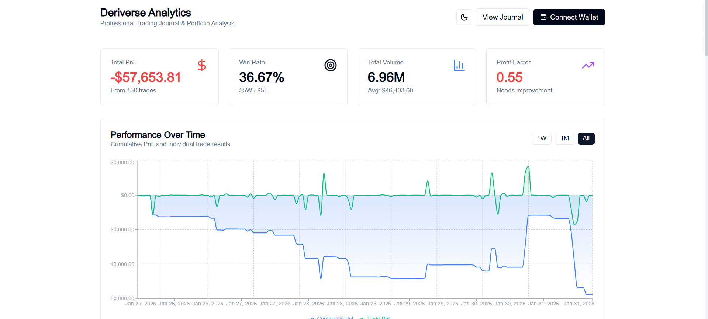
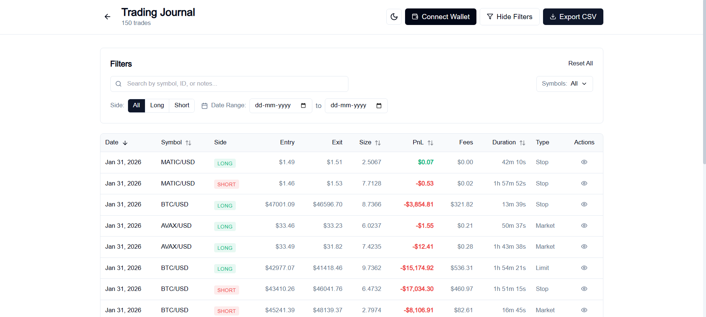
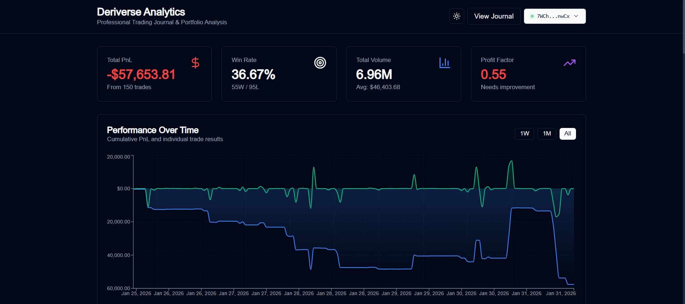

# 🚀 Deriverse Trading Analytics Dashboard

<div align="center">


### 📊 Real-Time Trading Analytics Platform for Data-Driven Decisions

A full-featured trading dashboard designed to help traders **analyze performance, track metrics, and optimize strategies** using real-time data and advanced visualizations.

[🔗 Live Demo](https://trading-dashboard-nine-fawn.vercel.app/) • [🐛 Report Bug](https://github.com/Armaansaxena/Trading-Dashboard/issues) • [✨ Request Feature](https://github.com/Armaansaxena/Trading-Dashboard/issues)

</div>

---

## 🎯 Why This Project Matters

Most traders rely on multiple tools to track performance, analyze trades, and monitor risk — leading to **fragmented insights and poor decisions**.

👉 This dashboard solves that by providing a **unified, real-time analytics platform** with professional-grade insights.

---

## ⚡ Key Highlights

* 📊 **Complete Trading Analytics** – PnL, Sharpe Ratio, Drawdown, Risk/Reward
* 📈 **Interactive Visualizations** – Real-time charts for performance tracking
* 📝 **Professional Trading Journal** – Filter, sort, and analyze trades
* 💼 **Portfolio Insights** – Symbol-wise and order-type performance
* 🔐 **Solana Wallet Integration** – Phantom, Solflare support
* 🌗 **Dark/Light Mode** – Fully responsive UI
* 📤 **Export Ready** – CSV export for external analysis

---

## 🧠 Architecture Overview

```
Frontend (Next.js + React)
        ↓
State Management (Zustand)
        ↓
Analytics Engine (Custom Logic)
        ↓
External APIs / Wallet Integration
        ↓
Data Visualization (Charts)
```

---

## 🛠️ Tech Stack

**Frontend:** Next.js 14, React, TypeScript
**Styling:** Tailwind CSS
**Charts:** Recharts
**State Management:** Zustand
**Blockchain:** Solana Web3.js, Wallet Adapter
**Utilities:** date-fns, clsx

---

## 📊 Core Features

### 📈 Trading Analytics

* Total PnL tracking with trend visualization
* Win rate, profit factor, and risk metrics
* Drawdown and volatility analysis
* Long/Short performance comparison

---

### 📅 Time-Based Insights

* Hourly performance heatmap
* Day-of-week trading analysis
* Session-based performance tracking

---

### 📝 Trading Journal

* Advanced filtering (symbol, side, date range)
* Sortable trade table with pagination
* Trade details with notes & tags
* CSV export support

---

### 💼 Portfolio Analysis

* Symbol-level performance insights
* Order type breakdown (market, limit, stop)
* Fee analysis and tracking

---

## 📸 Screenshots

### 📊 Dashboard



### 📝 Trading Journal



### 🌙 Dark Mode



---

## 🚀 Getting Started

```bash
git clone https://github.com/Armaansaxena/Trading-Dashboard.git
cd Trading-Dashboard
npm install
npm run dev
```

---

## 🔮 Future Improvements

* 🔔 Real-time alerts & notifications
* 📊 Portfolio tracking with authentication
* ⚡ Backend integration for persistent data
* 🤖 AI-based trading insights

---

## 👨‍💻 Author

**Armaan Saxena**
GitHub: https://github.com/Armaansaxena

---

## ⭐ Final Note

This project demonstrates:

* 📊 Product thinking (not just coding)
* ⚡ Real-time data handling
* 🧠 Financial domain understanding
* 🎨 Clean and scalable UI architecture

---

<div align="center">

⭐ Star this repo if you find it valuable!

</div>
